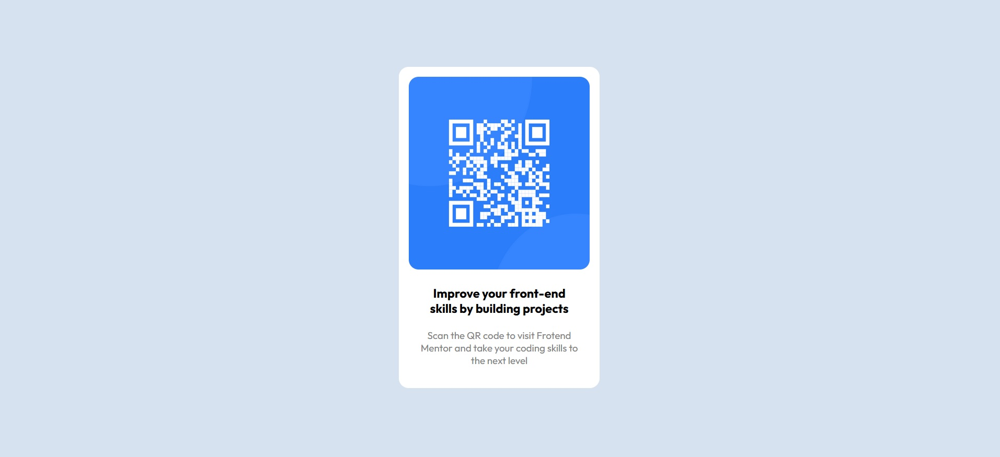

# Frontend Mentor - QR code component solution

This is a solution to the [QR code component challenge on Frontend Mentor](https://www.frontendmentor.io/challenges/qr-code-component-iux_sIO_H). Frontend Mentor challenges help you improve your coding skills by building realistic projects. 

## Table of contents
- [Link](#link)
- [Screenshot](#screenshot)
- [My process](#my-process)
  - [Built with](#built-with)
  - [What I learned](#what-i-learned)

### Link
https://radu-constantin.github.io/qr_code_component/

### Screenshot

## My process

### Built with

- HTML
- CSS
- Flexbox

### What I learned

Recapped some HTML and CSS concepts.
